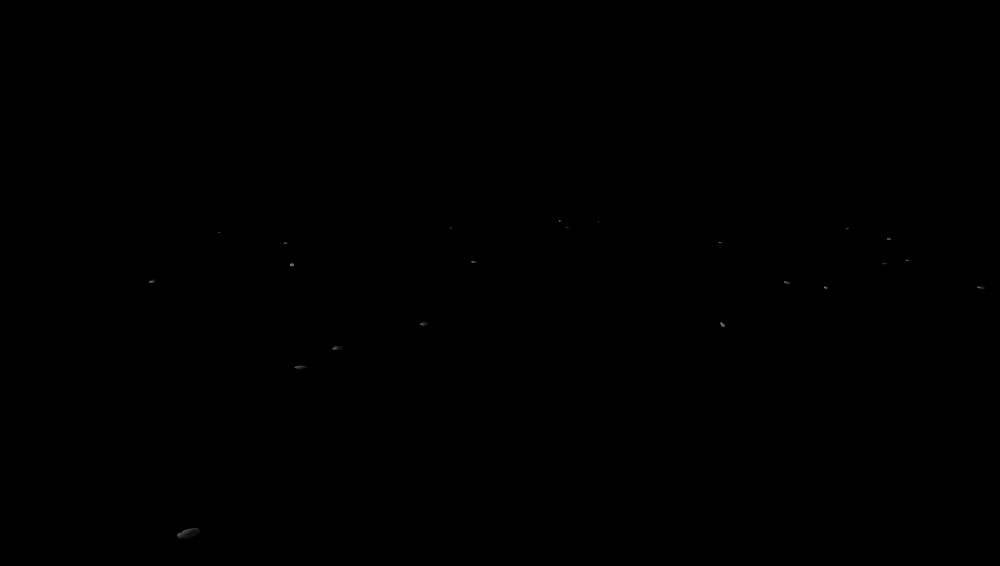
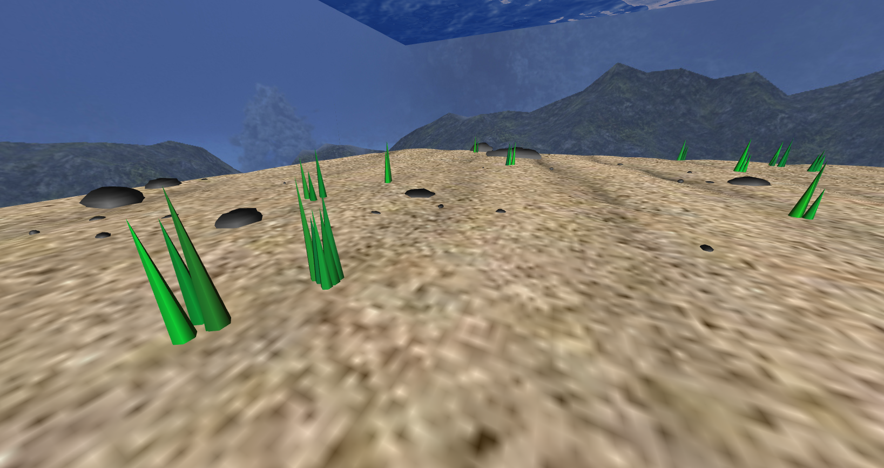

# CGRA 2020/2021

## Group T04G03

Ana Rita Antunes Ramada - up201904565
  Pedro Diogo Figueiredo - up201904675

## Project Notes

Everything was implemented as planned.

We changed the camera to have a third person mode, which is the default. To go into free camera mode press the button "Free Camera" on the controls.
While in third person mode, there are camera settings that can be changed according to preference, such as "Camera Angle", "Camera Height" and "Camera Radius", all of which apper as sliders on the controls.
While pressing the "V" button in third person mode, the camera flips (going from showing back of the fish to showing front of the fish).

In order to implement anemone animation, we created an improved version of MyCylinder, MyNewCylinder, that allows for customization of both stacks and slices (which are necessary for the bending effect on the tentacles). We also created an improved shader for the tentacles, to create animation while mantaining transparency.

## Screenshots

### 1 - MyFish

### 2 - MySeaFloor and MyAnemoneNest

Our nest was inspired by sea anemones.

### 3 - MyWaterSurface

### 4 - MyRock and MyRockSet

### 5 - My Pillar

### 6 - Panoramic View

### 7 - Rock Interactions

### 8 - Extra Functionaties

#### 8.1 - SeaWeed

#### 8.2 - Improved Fish Shader

#### 8.3 - Other Animated Fish

